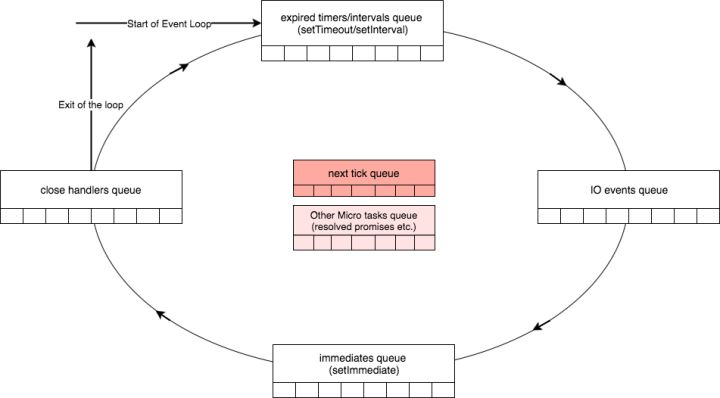

# Nodejs的事件轮询
## 什么是事件轮询
事件轮询是Nodejs处理非阻塞I/O事件的机制，虽然javascript是单线程，但是有时候会把一些操作转移到操作系统内核去处理。

操作系统内核都是多线程的，它们可以在后台处理多种操作，当其中一个事件处理完成的时候,内核会通知Nodejs，将该事件的回调函数添加到轮询队列里等待执行。


## 事件轮询机制
Nodejs启动后，初始化事件轮询，按照下图的顺序开始处理事件循环。


上图每一个框都是事件循环机制里的一个阶段，每个阶段都有一个先进先出的队列来执行回调，直到队列里的callback都被执行完或者callbacl的已经达到了最大回调数，才会进入到下个阶段。
## 每个阶段的详细概述
### 定时器
本阶段执行已经安排的setTimeout() 和 setInterval() 的回调函数。如果已经了解过javascript的setTimeout()就知道，计时器不能保证在用户期望的阈值时间处理回调，因为操作系统回调或者其他回调可能会延迟它们。*轮询机制的poll阶段控制定时器什么时候执行。*

例如，假设您计划在 100 毫秒后执行超时阈值，然后您的脚本开始异步读取文件，这需要 95 毫秒:
```javascript
const fs = require('fs');

function someAsyncOperation(callback) {
  // Assume this takes 95ms to complete
  fs.readFile('/path/to/file', callback);
}

const timeoutScheduled = Date.now();

setTimeout(() => {
  const delay = Date.now() - timeoutScheduled;

  console.log(`${delay}ms have passed since I was scheduled`);
}, 100);


// do someAsyncOperation which takes 95 ms to complete
someAsyncOperation(() => {
  const startCallback = Date.now();

  // do something that will take 10ms...
  while (Date.now() - startCallback < 10) {
    // do nothing
  }
});
```
当事件循环进入 轮询 阶段时，它有一个空队列（此时 fs.readFile() 尚未完成），因此它将等待毫秒数，直到达到最快的计时器阈值为止。当它等待 95 毫秒通过时，fs.readFile() 完成读取文件，它需要 10 毫秒完成的回调将添加到 轮询 队列中并执行。当回调完成时，队列中不再有回调，因此事件循环将看到已达到最快计时器的阈值，然后将回滚到 计时器 阶段，以执行定时器的回调。在本示例中，您将看到计划中的计时器和执行的回调之间的总延迟将为 105 毫秒。

*setTimeout具体的回调时间 Max（同步代码执行的时间，传入的时间阈值）*

### 挂起的回调函数
此阶段执行延迟到下一个循环迭代的 I/O 回调。对某些系统操作（如 TCP 错误类型）执行回调。例如，如果 TCP 套接字在尝试连接时接收到 ECONNREFUSED，则某些 *nix 的系统希望等待报告错误。这将被排队以在 挂起的回调 阶段执行。
### 轮询
检索新的 I/O 事件执行与 I/O 相关的回调（几乎所有情况下，除了关闭的回调函数，它们由计时器和 setImmediate() 排定的之外），其余情况 node 将在此处阻塞。

轮询阶段主要有2个功能：
- 计算应该阻塞和轮询 I/O 的时间。
- 然后，处理 轮询 队列里的事件。

当事件循环进入 轮询 阶段且 没有计划计时器时 ，将发生以下两种情况之一：

- 如果 轮询 队列 不是空的 ，事件循环将循环访问其回调队列并同步执行它们，直到队列已用尽，或者达到了与系统相关的硬限制。

- 如果 轮询 队列 是空的 ，还有两件事发生：

    1. 如果脚本已按 setImmediate() 排定，则事件循环将结束 轮询 阶段，并继续 检查 阶段以执行这些计划脚本。

    2. 如果脚本 尚未 按 setImmediate()排定，则事件循环将等待回调添加到队列中，然后立即执行。

一旦 轮询 队列为空，事件循环将检查 _已达到时间阈值的计时器_。如果一个或多个计时器已准备就绪，则事件循环将绕回计时器阶段以执行这些计时器的回调。
```javascript
// timeout_vs_immediate.js
const fs = require('fs');

fs.readFile(__filename, () => {
  setTimeout(() => {
    console.log('timeout');
  }, 0);
  setImmediate(() => {
    console.log('immediate');
  });
});
```
上面的程序打印结果是：
```javascript
$ node timeout_vs_immediate.js
immediate
timeout

```
此时，事件轮询队列在读文件后已经为空，定时器已经过期，应该是会先执行定时器才对呀。那是因为setImmediate() 在任何计时器（如果在 I/O 周期内）都将始终执行，而不依赖于存在多少个计时器。
### 检查阶段
此阶段允许人员在轮询阶段完成后立即执行回调。如果轮询阶段变为空闲状态，并且脚本已排队使用 setImmediate()，则事件循环可能继续到 检查 阶段而不是等待。

setImmediate() 实际上是一个在事件循环的单独阶段运行的特殊计时器。它使用一个 libuv API 来安排回调在 轮询 阶段完成后执行。
### 关闭的回调函数
如果套接字或处理函数突然关闭（例如 socket.destroy()），则'close' 事件将在这个阶段发出。否则它将通过 process.nextTick() 发出。
### Next tick队列 vs Other Microtasks
process.nextTick()和 Microtasks并没有出现在上面的轮询机制里，它们本来就不属于时间循环机制的一部分，但是事件循环的每一个阶段执行完都需要处理process.nextTick()和 Microtasks，我们称之为中间队列。

*Next tick队列比Other Microtasks队列具有更高的优先级*



如果中间队列有任何可执行项，则立即执行它们，直到中间队列已经被执行完，事件循环进行到下一个阶段。

process.nextTick如果一直填充中间队列，那事件循环就无法往下执行，这将导致I/O饥饿，除非清空nextTick队列。
```javascript
setTimeout(()=>{
    console.log('timer1')

    Promise.resolve().then(function() {
        console.log('promise1')
    })
}, 0)

setTimeout(()=>{
    console.log('timer2')

    Promise.resolve().then(function() {
        console.log('promise2')
    })
}, 0)
```
上例的结果：
```javascript
timer1
timer2
promise1
promise2
```
process.nextTick()的例子：
```javascript
const fs = require('fs')
const starttime = Date.now()
let endtime

fs.readFile('text.txt', () => {
  endtime = Date.now()
  console.log('finish reading time: ', endtime - starttime)
})

let index = 0

function handler () {
  if (index++ >= 1000) return
  console.log(`nextTick ${index}`)
  process.nextTick(handler)
  // console.log(`setImmediate ${index}`)
  // setImmediate(handler)
}

handler()
```
结果：
```javascript
nextTick 1
nextTick 2
......
nextTick 999
nextTick 1000
finish reading time: 170
```
替换成setImmediate()，运行结果：
```
setImmediate 1
setImmediate 2
finish reading time: 80
......
setImmediate 999
setImmediate 1000
```

参考链接：
> - 【译】NodeJS事件循环 Part 1 https://zhuanlan.zhihu.com/p/38395184
> - Node.js 事件循环，定时器和 process.nextTick() https://nodejs.org/zh-cn/docs/guides/event-loop-timers-and-nexttick/
> - https://luohaha.github.io/Chinese-uvbook/source/utilities.html
